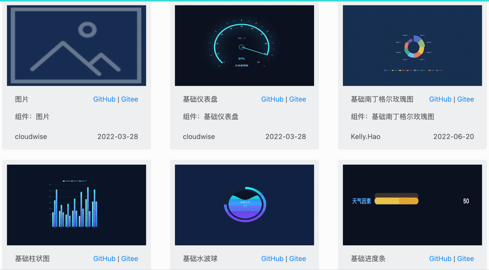

<div align="center">
  <a href="https://github.com/CloudWise-OpenSource/FlyFish"></a>
</div>

**[English](https://github.com/CloudWise-OpenSource/FlyFish/blob/main/README_EN.md)｜简体中文**

# 飞鱼（FlyFish）

[](https://github.com/CloudWise-OpenSource/FlyFish/pulls) [](https://github.com/CloudWise-OpenSource/FlyFish/blob/main/LICENSE) [](https://github.com/CloudWise-OpenSource/FlyFish/releases)<!-- ALL-CONTRIBUTORS-BADGE:START - Do not remove or modify this section -->
[](#contributors-)

<!-- ALL-CONTRIBUTORS-BADGE:END -->

## 见码如面

飞鱼（FlyFish）是一个数据可视化编码平台。通过简易的方式快速创建数据模型，通过拖拉拽的形式，快速生成一套数据可视化解决方案。

|  |  |
| -------------------------------------------------- | -------------------------------------- |

## FlyFish 功能概览

- 项目管理：项目用于代表具体的业务需求场景，是多个应用、组件的集合。
- 应用开发：支持开发大屏应用，可开发单页面或是多页面路由的大屏应用。
- 组件开发：组件为最小粒度的项目基础，通过创建和开发组件拼凑出最终的可视化大屏展示。
- 模板库：可将开发完成的应用/组件分别上传到对应的模板库中，可在已有模板的基础上快速创建新的项目。
- 数据源管理：可接入 MySQL、Http 等多个数据库数据生成对应数据源，供创建项目时组件对数据进行调用。
- 数据查询：支持根据数据表进行 SQL 查询，精准定位数据源中具体数据并封装保存，也可将查询到的数据重新组合，供组件直接调用。

|  |  |
| ------------------------------------------------ | ------------------------------------------------ |

## FlyFish 模版中心

- **[模版中心](https://www.cloudwise.ai/flyFishComponents.html)**
- **[源码下载](https://github.com/CloudWise-OpenSource/FlyFishComponents)**



## 快速上手

**国内镜像**：https://gitee.com/CloudWise/fly-fish

**Demo 环境地址**：http://flyfish-demo.cloudwise.com

## 本地部署

### 占用端口

| 服务台                                | 端口  |
| ------------------------------------- | ----- |
| FlyfishWeb 端口(nginx 静态资源代理)   | 8089  |
| FlyfishCodeServer(在线编辑器)端口     | 8081  |
| FlyfishServer(主后端服务)端口         | 7001  |
| FlyfishDataServer(数据源管理服务)端口 | 18532 |

### 部署流程

> 推荐使用 doc 目录内 flyfish dcoker 部署文档，后续有关部署流程、学习资料、FAQ 等统一放置 doc 目录中管理。

 [Flyfish docker镜像使用指南](./doc/FlyFish_docker镜像使用指南.md)

> 手动安装步骤：

- [01-基础环境准备篇](./doc/01-基础环境准备篇.md)
- [02-code_server 部署篇](./doc/02-code_server部署篇.md)
- [03-FlyFish 平台部署篇](./doc/03-FlyFish平台部署篇.md)

> 或执行一键脚本：

```bash
# CentOS 7.5/7.6  x86-64
# 须使用root账户
# 可在任意有权限的目录下安装 FlyFish
# 这里指定安装目录为 /data/app/
mkdir -p /data/app/
cd /data/app/

git clone -b main https://github.com/CloudWise-OpenSource/FlyFish.git FlyFish
or
git clone -b main https://gitee.com/CloudWise/fly-fish.git FlyFish

cd /data/app/FlyFish
# 一键安装
bash flyfish.sh install

# 一键卸载
bash flyfish.sh uninstall

```

## 升级流程

```
# 1、更新代码
$ git checkout main
$ git pull
```

## 学习资料

- **[技术文档](http://docs.aiops.cloudwise.com/zh/flyfish)**
- **[教学视频](http://docs.aiops.cloudwise.com/zh/flyfish/video-course/P1.html)**
- **[官方论坛](http://bbs.aiops.cloudwise.com/t/FlyFish)**

## 参与贡献

点击阅读 **[FlyFish 贡献指南](https://github.com/CloudWise-OpenSource/FlyFish/discussions/140)** 参与贡献，同时由衷感谢那些为 FlyFish 做出贡献的开发者，无论是 issue 问题、文档翻译、代码贡献，FlyFish 的发展离不开你的支持

## Contributors ✨

Thanks goes to these wonderful people ([emoji key](https://allcontributors.org/docs/en/emoji-key)):

<!-- ALL-CONTRIBUTORS-LIST:START - Do not remove or modify this section -->
<!-- prettier-ignore-start -->
<!-- markdownlint-disable -->
<table>
  <tr>
    <td align="center"><a href="https://github.com/soulferryman"><br /><sub><b>soulferryman</b></sub></a><br /><a href="https://github.com/CloudWise-OpenSource/FlyFish/commits?author=soulferryman" title="Code">💻</a></td>
    <td align="center"><a href="https://github.com/YouYe"><br /><sub><b>Cary Zhou</b></sub></a><br /><a href="https://github.com/CloudWise-OpenSource/FlyFish/commits?author=YouYe" title="Code">💻</a></td>
    <td align="center"><a href="https://blog.csdn.net/xiaohu12685"><br /><sub><b>tiger wang</b></sub></a><br /><a href="#design-xiaohu12685" title="Design">🎨</a> <a href="https://github.com/CloudWise-OpenSource/FlyFish/commits?author=xiaohu12685" title="Code">💻</a> <a href="#question-xiaohu12685" title="Answering Questions">💬</a> <a href="#fundingFinding-xiaohu12685" title="Funding Finding">🔍</a></td>
    <td align="center"><a href="https://github.com/jincheny"><br /><sub><b>jincheny</b></sub></a><br /><a href="#blog-jincheny" title="Blogposts">📝</a> <a href="https://github.com/CloudWise-OpenSource/FlyFish/commits?author=jincheny" title="Documentation">📖</a></td>
    <td align="center"><a href="https://github.com/RiseHao1029"><br /><sub><b>Rise.Hao（郝玉鹏）</b></sub></a><br /><a href="https://github.com/CloudWise-OpenSource/FlyFish/pulls?q=is%3Apr+reviewed-by%3ARiseHao1029" title="Reviewed Pull Requests">👀</a></td>
    <td align="center"><a href="https://github.com/Markuuuu"><br /><sub><b>Crete.A</b></sub></a><br /><a href="https://github.com/CloudWise-OpenSource/FlyFish/commits?author=Markuuuu" title="Code">💻</a></td>
    <td align="center"><a href="http://www.cloudwise.com"><br /><sub><b>Neeke Gao</b></sub></a><br /><a href="#design-Neeke" title="Design">🎨</a></td>
    <td align="center"><a href="https://github.com/maxDwq"><br /><sub><b>dwq</b></sub></a><br /><a href="https://github.com/CloudWise-OpenSource/FlyFish/pulls?q=is%3Apr+reviewed-by%3AmaxDwq" title="Reviewed Pull Requests">👀</a></td>
    <td align="center"><a href="https://github.com/sssssssugar"><br /><sub><b>sugar</b></sub></a><br /><a href="https://github.com/CloudWise-OpenSource/FlyFish/commits?author=sssssssugar" title="Code">💻</a></td>
  </tr>
  <tr>
    <td align="center"><a href="https://github.com/772566741qqcom"><br /><sub><b>haifeng.wang</b></sub></a><br /><a href="https://github.com/CloudWise-OpenSource/FlyFish/commits?author=772566741qqcom" title="Code">💻</a></td>
    <td align="center"><a href="https://github.com/imjaden"><br /><sub><b>Jaden.Li</b></sub></a><br /><a href="#example-imjaden" title="Examples">💡</a></td>
    <td align="center"><a href="https://github.com/osramywj"><br /><sub><b>osramywj</b></sub></a><br /><a href="#ideas-osramywj" title="Ideas, Planning, & Feedback">🤔</a></td>
    <td align="center"><a href="https://github.com/cw-jonny"><br /><sub><b>cw-jonny</b></sub></a><br /><a href="https://github.com/CloudWise-OpenSource/FlyFish/commits?author=cw-jonny" title="Code">💻</a></td>
    <td align="center"><a href="http://readw.cn"><br /><sub><b>aiwhj</b></sub></a><br /><a href="#audio-aiwhj" title="Audio">🔊</a></td>
    <td align="center"><a href="https://github.com/Rosso-Wang"><br /><sub><b>Rosso Wang</b></sub></a><br /><a href="https://github.com/CloudWise-OpenSource/FlyFish/commits?author=Rosso-Wang" title="Documentation">📖</a></td>
  </tr>
</table>

<!-- markdownlint-restore -->
<!-- prettier-ignore-end -->

<!-- ALL-CONTRIBUTORS-LIST:END -->

## 开发者社群

_获取更多关于 FlyFish 的技术资料，或加入 FlyFish 开发者交流群，可扫描下方二维码咨询。_


