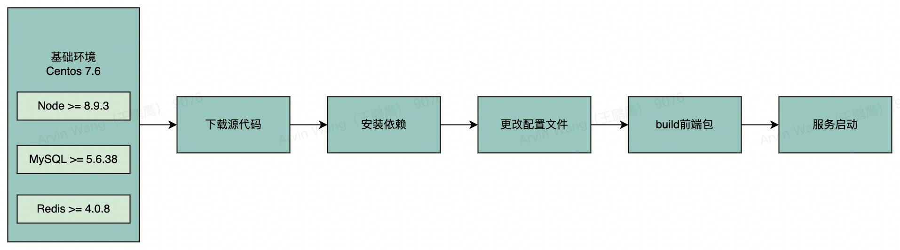

# 基础环境准备篇

> 工欲善其事，必先利其器！

环境准备是第一步也是低代码平台部署最重要的一步，如果环境准备不完备，下面部署工作会更加头痛，问题层出不穷。因此，如果想避免不必要的因为部署环境不一致导致的各种问题，大家在准备 flyfish 基础环境的时候要尽可能与文档的中基础环境保持一致。



### 一、基础环境

| 环境依赖 | 版本   | 说明          |
| -------- | ------ | ------------- |
| CentOS   | 7.6    |               |
| Node.js  | 14.9.0 | 推荐 14.x     |
| MongoDB  | 4.0.0  | >=4.0.0 即可  |
| Nginx    | 1.20.1 | >=1.19.0 即可 |
| pm2      | 5.1.2  | node 进程守护 |
| nvm      | 0.38.0 | node 版本管理 |

### 二、资源需求

> 资源需求经供参考，用户可根据自己的需求去定制服务器配置。

| 资源 | 说明  |
| ---- | ----- |
| CPU  | 8Core |
| 内存 | 16G   |
| 磁盘 | 200G  |

### 三、基础环境准备

0. 基础软件

> yum install git

1. Node.js 安装部署（以node@14.9.0为例）

> node.js 下载地址：https://nodejs.org/dist/

```bash
# 创建安装目录
mkdir -p /usr/local/node/
cd /usr/local/node/

# 1.下载 nodejs 的tar包
wget -c https://nodejs.org/dist/v14.9.0/node-v14.9.0-linux-x64.tar.xz

# 解压并删除安装包
tar -xvf node-v14.9.0-linux-x64.tar.xz
rm -rf node-v14.9.0-linux-x64.tar.xz

# 配置全局环境
vim /etc/profile

# 将变量配置添加到/etc/profile尾部
export NODE_HOME=/usr/local/node/node-v14.9.0-linux-x64
export PATH=$NODE_HOME/bin:$PATH

# 使/etc/profile生效
source /etc/profile

# 验证
[root@localhost ~] node -v
v14.9.0

# 切换 npm 源
npm config set registry=https://registry.npmmirror.com
```

⚠️ 注意！

如果环境上已有 nodejs 但是版本和文档不一致且当前 nodejs 版本无法正常运行 FlyFish，建议您使用 nvm 来管理 nodejs 版本。

2. nvm（以nvm@0.38.0为例）

```bash
# 下载 nvm 源码(一定要在 ~ 目录下)
cd ~
git clone https://gitee.com/mirrors/nvm

# 执行 nvm.sh 文件
source nvm/nvm.sh

# 设置 nvm 自动运行
echo "source ~/nvm/nvm.sh" >> ~/.bashrc
source ~/.bashrc

# 验证执行是否成功
nvm --version

# 切换镜像
NVM_NODEJS_ORG_MIRROR=https://npmmirror.com/mirrors/node

# 安装 nodejs
nvm install --lts （最新稳定版）
nvm install v14.9.0 （指定版本）

# 指定默认版本nodejs（否则下次登录会找不到nodejs）
nvm alias default v14.9.0

```

3. pm2 (以pm2@5.1.2为例)

> FlyFish-2.1.0 版本以后 pm2 用于启动 code-server 服务

```bash
# 安装 pm2
npm install -g pm2@5.1.2

```

4. MongoDB 部署（以MongoDB@4.0为例）

> MongoDB 下载地址：https://www.mongodb.com/download-center/community

配置 yum 存储库

```bash
# 创建 mongodb-org-4.0.repo 文件
touch /etc/yum.repos.d/mongodb-org-4.0.repo

# 添加配置
vim /etc/yum.repos.d/mongodb-org-4.0.repo

```

复制以下配置到 mongodb-org-4.0.repo

```bash
[mongodb-org]
name=MongoDB Repository
baseurl=http://mirrors.aliyun.com/mongodb/yum/redhat/7Server/mongodb-org/4.0/x86_64/
gpgcheck=0
enabled=1
```

安装 mongodb 以及修改配置

```bash
# 安装 mongodb
yum -y install mongodb-org

# 查看安装位置
whereis mongod

# 启动 mongodb
systemctl start mongod.service

# 查看 mongodb 状态
systemctl status mongod.service

# 配置外网访问
vim /etc/mongod.conf
bind_ip=127.0.0.1 改为 bing_ip=0.0.0.0

# 重启 mongodb
systemctl restart mongod.service

```

5. Nginx 部署（Nginx@1.20.1为例）

> 代理前端静态资源

配置 yum 存储库

```bash
# 创建 nginx.repo 文件
touch /etc/yum.repos.d/nginx.repo

# 添加配置
vim /etc/yum.repos.d/nginx.repo

```

复制以下配置到 nginx.repo

```bash
[nginx]
name=nginx repo
baseurl=http://nginx.org/packages/centos/7/$basearch/
gpgcheck=0
enabled=1
```

安装 nginx 以及修改配置

```bash
# 安装 nginx
yum install -y nginx-1.20.1

# 设置开机自启
systemctl enable nginx

# 启动
systemctl start nginx

```

开启 gzip

```BASH
nginx 配置文件位置检查
/usr/local/nginx/sbin/nginx -t
nginx: the configuration file /usr/local/nginx/conf/nginx.conf syntax is ok
nginx: configuration file /usr/local/nginx/conf/nginx.conf test is successful

# 修改配置,开启 gzip
vim /etc/nginx/nginx.conf
or
vim /usr/local/nginx/conf/nginx.conf
```

nginx.conf 的 http 中添加以下配置

```nginx
gzip  on;
gzip_min_length 1k;
gzip_vary on;
gzip_disable "MSIE [1-6]\.";
gzip_types text/plain application/javascript application/x-javascript text/javascript text/xml text/css;
gzip_comp_level 4;
gzip_buffers 4 16k;
```

重载配置

```bash
# 重启
systemctl restart nginx
or
/usr/local/nginx/sbin/nginx -s reload
```

6. Git clone FlyFish

```
mkdir -p /data/app/
cd /data/app/

git clone -b main https://github.com/CloudWise-OpenSource/FlyFish.git
or
git clone -b main https://gitee.com/CloudWise/fly-fish.git FlyFish

```
