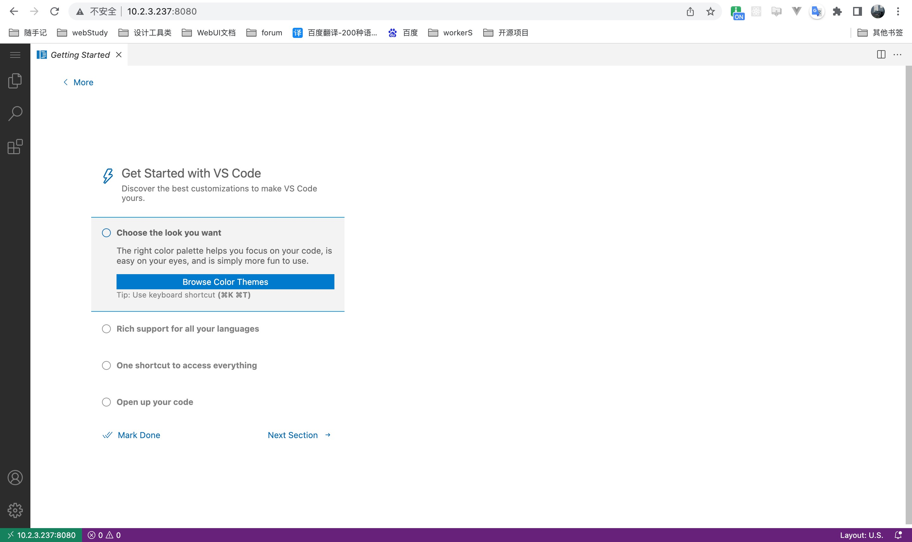
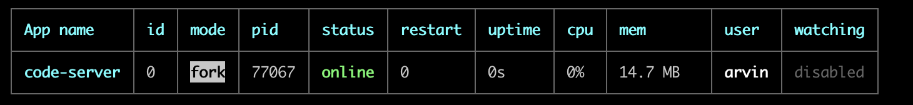

# LCAPCodeServer 部署篇

> vscode 在线编码！



### 一、修改配置

> 默认就是以下配置，无需修改！

```bash
# 进入 code-server 目录
cd /data/app/FlyFish/lcapCodeServer/

# 修改 bind-addr 为 0.0.0.0:8081 外网访问
vim config.yaml

```

### 二、启动服务

> flyfish 已集成 pm2 命令直接使用 npm 启动 code-server 服务即可

```bash
# linux环境
npm run linux-start

# mac环境
npm run macos-start

```



### 三、验证 code-server 部署是否成功

访问链接：http://ip:8081
