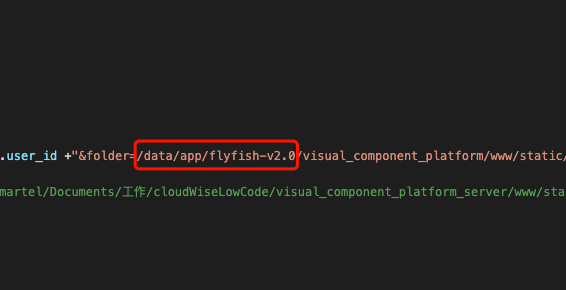

### 平台部署流程

#### 一、依赖组件即版本
```
 Node >= 8.9.3
 
 MySQL = 5.x
 
 Redis >= 4.0.8
 
```

#### 二、编辑服务端配置文件
1. 进入项目
```
cd visual_component_platform

```

2. 安装项目依赖包
```
npm install
```


3. 初始化数据库配置
```
vim config/database.dev.json

"host": "数据库主机",
"user": "数据库用户",
"password": "数据库密码",
"database": "visual_component_platform"
```

4.编辑src/common/config/config.js
```
vim src/common/config/config.js

 port: "服务端口号",
 host: '主机ip',
 workers: 0,
```

5.编辑src/common/config/adapter.js
```
vim src/common/config/adapter.js

// 配置redis
 exports.cache = {
     redis: {
         port: "redis端口",
         host: 'redis主机ip',
         password: ''
     }
 };
 
// 配置MySQL
exports.model = {
    mysql: {
        database: 'visual_component_platform',
        user: '数据库用户',
        password: '数据库密码',
        host: '数据库主机IP',
        port: '数据库端口',
    }
};
```

#### 三、编辑前端配置文件
1. 编辑可视化平台配置文件
```
vim www/static/visual_component_platform/config/ENV.js

var rootPath = '/pw/';     // 路由的根路径
var apiDomain = 'http://ip:port';    // api请求接口
```

2. 编辑平台入口配置文件
```
vim www/static/visual_component_platform/config/ENV.js

platformClassify: [
    {
        label: '组件开发平台',
        url: 'http://${服务器ip}:8363',
    },
    {
        label: '数据应用平台',
        url: 'http://${服务器ip}:8362',
    }
]
```
#### 四、项目内使用code-server
```
1:vim visual_component_platform_web/src/routes/dataVisualComponents/components/ComponentCreate/CodeEditor.jsx

2: 修改 codeServerUrl 地址为组件所在目录地址，注意：修改截图红框内前缀即可：
```


```
3: 更新前端工程文件即可，参考【五、启动项目（4.更新前端代码）】
```
#### 五、启动项目
1. 创建数据库
```
CREATE DATABASE IF NOT EXISTS visual_component_platform DEFAULT CHARSET utf8 COLLATE utf8_general_ci;

```

2. 初始化表
```
npm run init_database_dev

```

3. 启动应用
```
pm2 start dev.js -n 'flyfish_visual_component_platform'
```

4. 更新前端工程代码
```
cd visual_component_platform_web
npm run build

rm -rf ../visual_component_platform/www/static/visual_component_platform/platform
mv ./platform ../visual_component_platform/www/static/visual_component_platform/

pm2 restart flyfish_visual_component_platform
```

