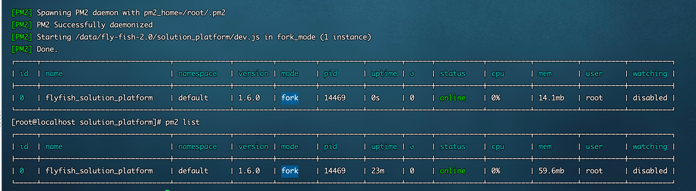

# 应用平台部署篇 v2.0

> solution-platform-web、solution_platform 部署流程

### 一、前端源码打包部署

> solution-platform-web 应用平台前端源码，flyfish 采用的是前后端分离开发混合部署的模式，前端 build 后的部署包放在对应的 solution_platform 应用平台后端 www/static/solution_platform_web 下即可。

```bash
# 进入应用平台前端源码目录
cd solution-platform-web

# 安装依赖
npm install

# 打包
npm run build

# 终端输出打包成功！
# 在 solution-platform-web 目录下生成 release 部署包内包含 platform、index.html
# 将 release 中的静态资源放入 solution_platform 应用平台后端 www/static/solution_platform_web 下即可

```

**⚠️ 注意！**

应用平台后端 www/static/solution_platform_web 下已有前端部署包，将新打包的部署包替换旧包即可，如嫌麻烦也可直接使用旧前端包。

### 二、应用平台前后端部署

> flyfish 后端集成多种运行模式，production、development、staging 等，其实每种模式对于用户来说并无差别，只是为了方便开发人员开发，文档默认使用 development 模式，对应只修改 development 配置即可。

#### 应用平台后端部署

1. 安装依赖

```bash
# 进入应用平台后端源码目录
cd solution_platform

# 安装应用平台后端依赖
npm install

```

2. 修改初始化数据库配置

```bash
# 编辑文件
vim config/database.dev.json

# 修改IP（host）、修改数据库用户名（user）、修改数据库密码（password）
{
  "mysql": {
    "driver": "mysql",
    "host": "10.2.3.153",
    "user": "Rootmaster",
    "password": "Rootmaster@777",
    "database": "solution_platform"
  }
}

```

3. 编辑 src/common/config/config.js

```bash
# 编辑文件
vim src/common/config/config.js

# port默认8362（不建议修改）、服务 worker 进程
port: "8362",
host: '主机ip',
workers: 0,

```

4. 编辑 src/common/config/adapter.js

```bash
# 编辑文件
vim src/common/config/adapter.js

# 配置redis
exports.cache = {
  redis: {
    port: "6379",
    host: 'redis主机ip',
    password: ''
  }
};

# 配置MySQL
exports.model = {
  mysql: {
    database: 'flyfish',
    user: '数据库用户',
    password: '数据库密码',
    host: '数据库主机IP',
    port: '数据库端口',
  }
};

```

#### 应用平台前端配置文件修改

1. 编辑应用平台前端配置文件

```bash
# 编辑文件
cp www/static/solution_platform_web/config/ENV.js www/static/solution_platform_web/config/ENV.production.js

vim www/static/solution_platform_web/config/ENV.production.js

var rootPath = '/pw/';     // 路由的根路径
var apiDomain = 'http://ip:8362';    // api请求接口

```

2.  编辑大屏配置文件(注意：如果解决方案包括大屏才进行配置)

```bash
# 编辑文件
cp www/static/big_screen/config/env.js www/static/big_screen/config/env.production.js

vim www/static/big_screen/config/env.production.js

var apiDomain = 'http://ip:8362';    // api请求接口,即解决方案本身的服务地址

```

3. 编辑大屏入口文件

```bash
# 第一步
cp www/static/big_screen/editor.html www/static/big_screen/editor.production.html

vim www/static/big_screen/editor.production.html

<script type="text/javascript" src="{飞鱼平台IP:8362}/static/public_visual_component/{飞鱼平台account_id}/env.component.js"></script>

# 例如
<script type="text/javascript" src="http://localhost:8362/static/public_visual_component/1/env.component.js"></script>


# 第二步
cp www/static/big_screen/index.html www/static/big_screen/index.production.html

vim www/static/big_screen/index.production.html

<script type="text/javascript" src="{飞鱼平台IP:8362}/static/public_visual_component/{飞鱼平台account_id}/env.component.js"></script>

# 例如
<script type="text/javascript" src="http://localhost:8362/static/public_visual_component/1/env.component.js"></script>

```

4. 编辑平台入口配置文件

```bash
# 编辑文件
vim www/static/solution_platform_web/config/ENV.js

platformClassify: [
    {
      label: '组件开发平台',
      url: 'http://${服务器ip}:8363',
    },
    {
      label: '数据应用平台',
      url: 'http://${服务器ip}:8362',
    }
]

```

#### 启动项目

1. 创建数据库

```sheLL
# 执行 sql 创建数据库
CREATE DATABASE IF NOT EXISTS solution_platform DEFAULT CHARSET utf8 COLLATE utf8_general_ci;

# 初始化表
npm run init_database_dev

# 启动应用
pm2 start dev.js -n 'flyfish_solution_platform'

```



#### FAQ：

如果项目依赖安装失败，推荐您使用删除 node_modules，使用 cnpm、yarn、pnpm 等包管理器重新安装依赖。
